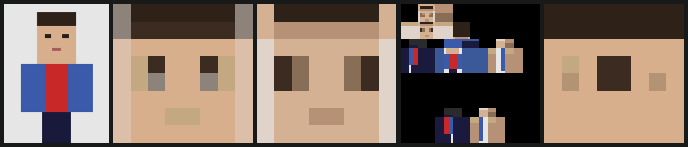

# 架构：为什么像素不再由 AI 画



*从左到右：源图 · `box` · `dpid` · 组装出的完整皮肤 · `dominant`。用 `python3 tools/compare.py --demo --eyes 0.385,0.210,0.615,0.250 --out docs/method-comparison.png` 复现。*

---

## 0. 诊断

旧管线让 Gemini 逐像素输出 head 六个面和 body_front 的调色板索引网格（480 个格子）。这条路走不通，原因不是 prompt 不够好，而是**语言模型没有像素级空间精度**：它无法可靠地把一只眼睛放在第 2 行第 2 列。再怎么调 prompt 也改不了这件事，因为这不是知识问题。

于是重构的第一原则是：**AI 只做它真正擅长的语义判断，像素全部由真实的图像处理管线从照片本身推导。**

结果是 AI 的输出从 ~480 个格子降到约 20 个数字，调用更便宜、更快、几乎不再触发重试；而像素的质量从此由可测试、可复现的数值代码决定。

## 分层

```
app/imaging/          纯图像科学：无 AI、无 Web、无 Minecraft
  color.py            sRGB ↔ 线性光 ↔ OKLab，ΔE
  downscale.py        box / DPID / dominant，预锐化，宽高比裁剪
  quantize.py         OKLab 加权 k-means，带锚定角色槽的调色板
  metrics.py          SSIM、ΔE、detail

app/services/         Minecraft 领域层
  layout.py           AI：照片 → 语义（bbox + 角色颜色）。不产出任何像素
  renderer.py         照片 + layout → 每个面的像素。整条管线在这里编排
  shading.py          照片拍不到的面（背面、内侧）的程序化生成
  skin_map.py         64×64 UV 坐标表（未改动）
  skin_assembler.py   像素网格 → PNG（接口未改动）
  skin_store.py       PNG + 数据落盘

app/routers/skin.py   校验、编排、持久化。刻意保持很薄
```

`app/imaging` 与其余部分的分界是有意画得很硬的：颜色出了问题，要么是那一层的 bug（可以用单元测试证明），要么是上层的决策失误（在渲染结果里肉眼可见）。

---

## 1. 线性光

sRGB 存的大约是物理光强的 1/2.2 次方。降采样的本质是求平均，而**在编码值上求平均是没有数学意义的运算**：它会压暗边缘、抹掉细密纹理、吃掉高光。

`app/imaging/color.py` 之后的一切都在线性光或 OKLab 里进行。`tests/test_color.py::test_averaging_in_srgb_is_wrong` 把这件事钉成了回归测试：黑与白的正确中间调是 sRGB 188，不是 128。

## 2. 感知色彩空间

RGB 里的欧氏距离和"人眼觉得差多远"关系很弱。在 RGB 里跑 k-means，算法会把两个人一眼能分辨的肤色合并成一个色号，同时浪费两三个槽去区分谁也看不出差别的暗部——这就是"脸发脏"的成因。

所有聚类、距离、明度调整都在 **OKLab** 里做。程序化着色也从 HSV 改成了 OKLab：HSV 的 value 不是明度，用同样的 HSV 步长去压暗一个饱和蓝和一个浅黄，得到的感知差异完全不同，这正是过去程序化生成的部位看起来"不像同一张皮肤"的原因。

## 3. 降采样：三种策略，按内容选

64×64 皮肤意味着约 16 倍缩小：整张脸要活在 8×8 里，一只眼睛只有一两个像素。这个倍率下固定卷积核（bilinear / bicubic / Lanczos）必然失败。

| 方法 | 做法 | 用在哪 |
|---|---|---|
| `box` | 精确面积平均 | 正确的基线（大多数人以为 `resize` 干的就是这个） |
| `dpid` | 输入像素离本格均值**越远权重越大**（Weber et al., SIGGRAPH Asia 2016）；距离在 OKLab 里量 | **脸**（`head_front`、`head_top`） |
| `dominant` | 取本格众数色 | **衣服和四肢** |

按内容而不是全局选一种，是这里的关键决策：
- 脸要的是**特征存活**，哪怕平均色偏一点；
- 衣服要的是**色块干净**——白衬衫上的红色条纹必须还是红的，不能糊成粉。

`RenderConfig.face_method` / `material_method` 分别控制，可在 `.env` 里改。

## 4. 一张调色板管整张皮肤

每个区域各自量化，会让同一段前臂在手臂和手上落到两个略微不同的肤色。这里改成**一次全局加权 k-means**：所有区域的像素一起参与，脸的权重是其它部位的 5 倍（`FACE_SAMPLE_WEIGHT`），因为调色板的槽位应该花在人真正会看的地方。

前 7 个槽是**锚定**的语义角色，顺序固定：

```
0 skin_tone   1 hair_color   2 eye_color   3 shirt_main
4 arm_main    5 pants_main   6 shoe_color
```

锚定带来两个好处：程序化面一定拿得到它需要的颜色；而且改色变成了一次字符串替换——`POST /api/skin/{id}/recolor` 不调用 AI、不重新渲染，因为整张皮肤都画在这一张调色板上。

## 4b. 从「脸框」到「头框」

第一次真实的 vision 调用暴露了一个可预期但没被预期到的问题：**模型给的是脸框，不是头框**。它返回的是眉毛到下巴的范围——因为对一个检测器来说，"face" 本来就是这个意思。prompt 里写"whole head, hairline to chin"没有用。

后果是致命的：那次跑出来的 `head_front` 里眼睛落在第 2 行（8 行中），**一个头发格子都没有**；而头的侧面和背面都是从正面推导的，于是整颗头都没了头发。

`expand_head_box` 用一个解剖学先验来修：脸框大致占整颗头高度的下 60%，所以把上边界向上扩 0.45 倍框高就能把头顶捞回来，两侧扩 0.12 倍框宽（头发只比脸略宽）。下边界不动——下巴就是下巴。两个系数都在 `RenderConfig` 里，设成 0 即退回原行为。

顺带记一条教训：**这类系统性偏差要在代码里修，不要在 prompt 里修。** prompt 的措辞也一并加严了，但那只是第二道保险。

## 5. 眼睛：唯一一处语义先验

这是整条管线里唯一一次**覆盖降采样结果**的地方，而且它是因为一个被测量出来的失败才存在的：

8×8 下一只眼睛只占脸部裁剪的百分之几，`box`、`dpid`、`dominant` 三种方法都会把它平均进脸颊——而 SSIM 会**奖励**它们这么做，因为这个指标被大片平坦区域主导。

`stamp_eyes` 的做法不是照着 bbox 涂一条色带（够宽到容纳两只眼睛的带子同时也包含鼻梁和太阳穴，涂实了就是脸上一道杠），而是把 AI 报的眼部 bbox 当作**显著性掩码**：在这个带子里，每个格子按"比带内均值暗多少"被拉向 eye_color；本来就暗的（眼睛）变暗，本来就浅的（眼间和两侧皮肤）不动。量化之后再把选中的格子**吸附**到 eye_color 槽——混合出来的近眼色有可能离调色板里某个中性色更近，那会让棕眼睛变成灰眼睛。

带内被判为眼睛的格子上限是一半（`EYE_MASK_MAX_COVERAGE`），所以一个尺寸不对的 bbox 最坏也只是选错格子，不会画出一道横杠。`RenderConfig.eye_strength = 0` 可整体关掉。

## 6. 下一步：联合优化

第 5 节是一个便宜的替代品，真正的答案是**把降采样和量化写成一个目标函数一起解**，而不是先缩小再量化：

> 求 64×64、颜色取自 K 色调色板的 `X`，最小化 `perceptual(upsample(X), source)`。

- Gerstner et al., *Pixelated Image Abstraction* (NPAR 2012) 用交替迭代 + 模拟退火求解，几乎就是为这个问题写的论文；
- 现代写法：用 straight-through estimator（`x_q = x + (quantize(x) - x).detach()`）让量化可微，损失用 SSIM 或 LPIPS，直接 Adam 优化 `X` 和调色板。UV 分块约束、overlay 残差层、对称性都只是再加几项 loss。

在这个框架里，眼睛不需要特判：显著性加权的损失会自己决定把一个调色板槽和一个格子花在哪。

顺带一提，"受调色板约束的极限降采样"和**高光谱解混**在数学上同构：调色板 = endmembers，每格的归属 = abundances（加了 one-hot 约束）。

## 7. 关于指标要诚实的部分

`app/imaging/metrics.py` 返回 `ssim`、`delta_e_mean`、`delta_e_p95`、`detail`。

必须知道的是：**这四个数都是面积加权的，没有一个能告诉你"眼睛还在不在"。** 上面那张对比图里，`dominant` 的 SSIM 和 detail 都最高，但它把两只眼睛糊成了一块。所以：

- 不要用 L2/MSE 当优化目标——它的最优解就是"所有可能答案的平均"，也就是模糊；
- 调参时同时看 `ssim` 和 `detail`，并且**一定要看渲染出来的图**；
- 真正需要的是显著性加权的指标，那和第 6 节是同一件事。

## 8. 已知限制

- **眼部先验已验证可用，但需要更多样本。** 第一次真实调用里 `stamp_eyes` 正确落在了眼睛上，并且用上了模型识别出的琥珀色瞳色。目前只验证过一张图。
- **低对比度题材是当前的短板。** 金发 + 白裙 + 白背景这种组合，在 8×8 下头发和皮肤在 OKLab 里几乎重合，结果会整体发白。真人照片的明度分离度高得多。
- **头部侧面/背面是推导出来的**：侧面把 `head_front` 的边缘列横向拉伸，背面用发色填充加脖子行。正面照片里没有这些信息，这是个合理的猜测，不是还原。
- **8×8 的脸是硬上限。** 线稿风格（细线条眼睛、大面积平涂）在这个分辨率下尤其吃亏。

## 参考

- Weber et al., *Rapid, Detail-Preserving Image Downscaling*, SIGGRAPH Asia 2016
- Kopf, Shamir & Peers, *Content-Adaptive Image Downscaling*, SIGGRAPH Asia 2013
- Öztireli & Gross, *Perceptually Based Downscaling of Images*, SIGGRAPH 2015
- Gerstner et al., *Pixelated Image Abstraction*, NPAR 2012
- Ottosson, *A perceptual color space for image processing* (OKLab), 2020
- Wang et al., *Image Quality Assessment: From Error Visibility to Structural Similarity*, IEEE TIP 2004
